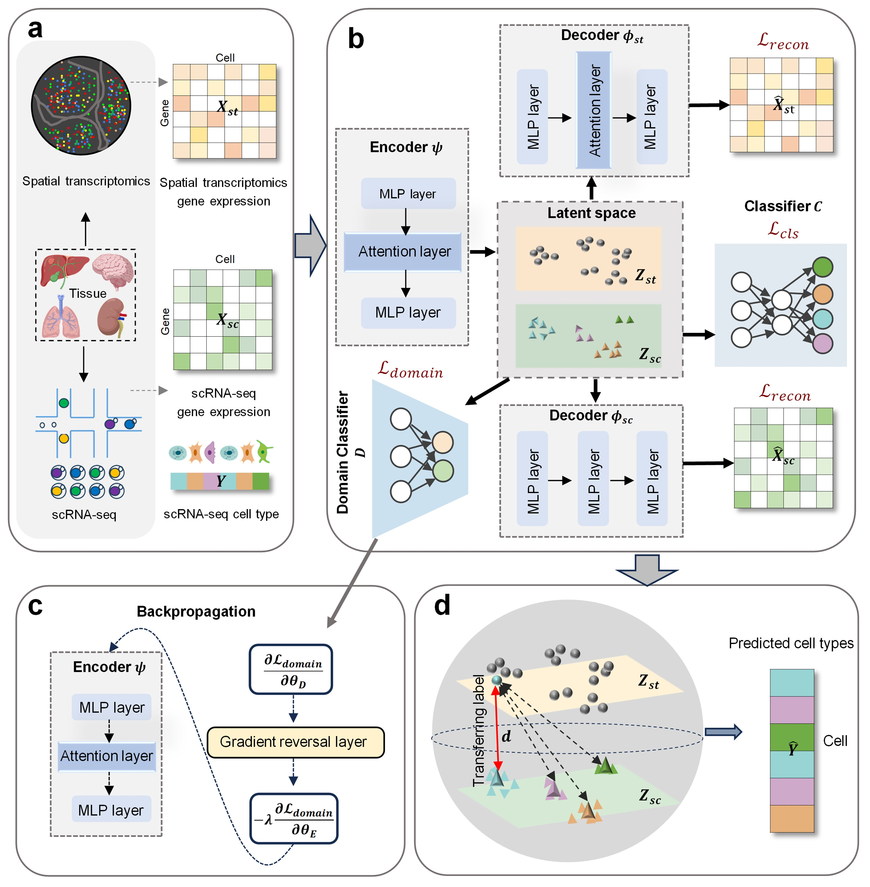

# CTMAP: An Adversarial Cross-Modal Learning Framework for Accurate and Robust Cell-Type Annotation

## Introduction

Single-cell spatial transcriptomics technologies, such as MERFISH, reveal gene expression profiles while preserving crucial spatial context. A key challenge in analyzing this data is performing accurate and automated cell-type annotation. `CTMAP` is a deep learning framework designed to address this by **integrating labeled single-cell RNA sequencing (scRNA-seq) reference data** with spatial transcriptomics profiles.

<div align="center">
  
</div>

## Prerequisites
*   **Package Manager**: We recommend using **Conda** to manage dependencies and environment for optimal reproducibility.
*   **Hardware**: **CTMAP is designed and tested for GPU acceleration.** The provided environment is configured for **CUDA 12.1**. Please ensure your NVIDIA driver is compatible (typically requires driver version >= 525.60.13).

## Installation & Setup

### **Standard Installation**
This method uses the provided `environment.yml` file to create a Conda environment with the **complete CUDA 12.1 toolchain and PyTorch 2.4.1**, ensuring full reproducibility and GPU performance.

1.  **Clone the repository**:
    ```bash
    git clone https://github.com/limpidwy/CTMAP-main.git
    cd CTMAP-main
    ```

2.  **Create the Conda environment from the `environment.yml` file**:
    ```bash
    conda env create -f environment.yml
    ```
    > **Note**: This command reads the `name: ctmap` field in the YAML file to name the environment. The process may take several minutes as it installs all dependencies, including CUDA libraries.

3.  **Activate the environment**:
    ```bash
    conda activate ctmap
    ```

## Data Preparation
The provided tutorial requires the example MERFISH datasets. Please follow these steps to set up the data:

1.  **Download the data**: Obtain the `adata_merfish.h5ad` and `adata_rna.h5ad` files (links or instructions for downloading can be added here).
2.  **Organize the data**: Place the downloaded files in the correct directory within the project:
    ```bash
    CTMAP-main/
    ├── dataset/
    │   └── MERFISH/
    │       ├── adata_merfish.h5ad   # Spatial transcriptomics (MERFISH) data
    │       └── adata_rna.h5ad       # scRNA-seq reference data
    └── ... (other project files)
    ```
3.  **Path Configuration**: The tutorial notebook (`tutorial.ipynb`) is configured to read data from the above path by default. If you place the data elsewhere, please update the file paths in the notebook accordingly.

## Tutorials
A step-by-step Jupyter Notebook tutorial is provided to run the full CTMAP pipeline.

*   **[Full CTMAP pipeline on the MERFISH dataset](./tutorial.ipynb)**: This tutorial demonstrates the complete workflow on a mouse hypothalamic preoptic region MERFISH dataset, covering data loading, model training, evaluation (Accuracy, NMI, ARI), spatial distribution plotting, and UMAP visualization.

To run it, ensure your `ctmap` environment is activated, launch Jupyter Lab/Notebook, and open the `tutorial.ipynb` file.

## Citation
If you use CTMAP in your research, please cite our preprint/publication (citation details will be added upon publication).

## License
This project is licensed under the terms specified in the [LICENSE](./LICENSE) file.
